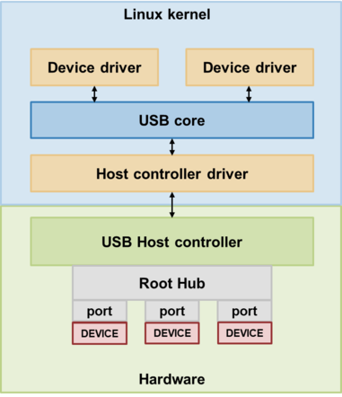
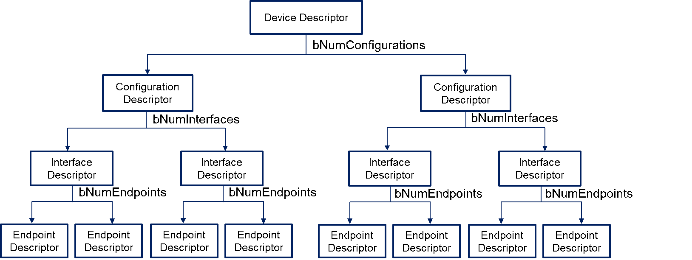

# REDS Security - Operational Protection

## 1. 개요
- REDS security의 operational protection 요구사항에 따라 460-network를 구성하는 장비의 connection point는 data source로의 연결에만 동작을 허가해야 하며 특히 USB 장치에 대해서는 USB device class 08h (USB mass storage)만 REDS에 사용할 수 있도록 해야 한다.
- 따라서 리눅스 커널이 어떻게 연결된 USB 장치의 class를 인식하고 그에 맞는 디바이스 드라이버를 연결시키는지 이해하고 커널 소스를 수정하여 포트마다 지정된 USB device class에만 동작을 하도록 커널을 수정한다. (Linux ubuntu사용, 커널 버전 : 4.19.0-rc5+)

## 2. Linux의 USB Subsystem
- USB 장치가 물리적으로 연결되면 USB host controller라고 하는 하드웨어 장치에서 먼저 이를 감지한다. (USB host controller는 PCI장치와 같은 bus 장치이며 기본적으로 Root Hub라고 하는 허브가 물리적으로 연결되어 있다. 따라서 장치가 실제로 연결되는 위치는 Root Hub의 한 포트이다.)
- 그리고 이 host controller의 종류와 일치하는 host controller driver는 host controller의 물리 계층 정보를 가져와서 상위 USB 프로토콜 명세의 정보로 변환하고 USB core에 정보를 채워 놓는다.
- 이렇게 되면 커널 영역의 driver들은 이 USB core의 정보를 통해 실제 연결된 USB 장치의 정보에 접근할 수 있고 이들을 관리할 수 있게 된다.
- 

## 3. USB Descriptors
- 모든 USB 장치는 USB descriptor를 통해 자신의 정보를 host에게 알려준다.
- USB descriptor의 종류는 Device Descriptor, Configuration Descriptor, Interface Descriptor, Endpoint Descriptor로 4가지가 있고 아래 그림과 같은 계층 구조를 가진다.
- 각 descriptor들은 구조체로 정의되어 있으며 상위 계층 descriptor 구조체에는 하위 계층 descriptor의 개수 정보를 가지고 있다. 
- 
 

### 3.1 Device descriptor
- Device descriptor에는 지원되는 USB 버전, Product ID, Vendor ID, 그리고 configuration descriptor의 수 등의 정보가 있다.
- Device descriptor는 USB 장치 전체를 대표하는 descriptor이므로 한 USB 장치에는 1개의 device descriptor만 존재한다. 

### 3.2 Configuration descriptor
- Configuration descriptor에는 해당 configuration에서의 장치의 전원 공급 방법, 최대 전력 소비량, 그리고 Interface descriptor의 수 등의 정보가 있다.
- 한 USB 장치에 여러 개의 Configuration descriptor가 존재할 수 있다.

### 3.3 Interface descriptor
- Interface descriptor에는 해당 Interface의 기능이 정의된 class 정보와 대체 인터페이스 정보(여러 기능을 가져야 하는 경우), 그리고 Endpoint descriptor의 수 등의 정보가 있다.
- 한 USB 장치에 여러 개의 Interface descriptor가 존재할 수 있다.

### 3.4 Endpoint descriptor
- Endpoint Descriptor는 실제 통신이 일어나는 지점인 Endpoint에 대한 전송 유형, 방향, 패킷 크기 등의 정보가 있다.
- Default control endpoint인 Endpoint 0에는 descriptor가 존재하지 않으며 한 USB 장치에 여러 개의 Endpoint descriptor가 존재할 수 있다.
 
## 4. USB device class
- 앞에서 간단하게 설명한 Interface descriptor의 구조체를 자세히 살펴보면 다음과 같다.
- (linux/include/uapi/linux/usb/ch9.h)
~~~
	struct usb_interface_descriptor {
		__u8 bLength;
		__u8 bDescriptorType;
		__u8 bInterfaceNumber;
		__u8 bAlternateSetting;
		__u8 bNumEndpoints;
		__u8 bInterfaceClass;
		__u8 bInterfaceSubClass;
		__u8 bInterfaceProtocol;
		__u8 iInterface;
	}
~~~

- 위 구조체의 필드중 bInterfaceClass가 USB 장치의 class를 나타내는 필드이며 이 필드에 들어가는 값들은 아래와 같이 정의되어 있다.
- (linux/include/uapi/linux/usb/ch9.h)
~~~
	/*
	 * Device and/or Interface Class codes
	 * as found in bDeviceClass or bInterfaceClass
	 * and defined by www.usb.org documents
	 */
	#define USB_CLASS_PER_INTERFACE		0	/* for DeviceClass */
	#define USB_CLASS_AUDIO			1
	#define USB_CLASS_COMM			2
	#define USB_CLASS_HID			3
	#define USB_CLASS_PHYSICAL		5
	#define USB_CLASS_STILL_IMAGE		6
	#define USB_CLASS_PRINTER		7
	#define USB_CLASS_MASS_STORAGE		8
	#define USB_CLASS_HUB			9
	#define USB_CLASS_CDC_DATA		0x0a
	#define USB_CLASS_CSCID			0x0b	/* chip+ smart card */
	#define USB_CLASS_CONTENT_SEC		0x0d	/* content security */
	#define USB_CLASS_VIDEO			0x0e
	#define USB_CLASS_WIRELESS_CONTROLLER	0xe0
	#define USB_CLASS_MISC			0xef
	#define USB_CLASS_APP_SPEC		0xfe
	#define USB_CLASS_VENDOR_SPEC		0xff

	#define USB_SUBCLASS_VENDOR_SPEC	0xff
~~~

- 위의 정의된 값들 중 8번을 보면 USB_CLASS_MASS_STORAGE라고 되어있고 이 값이 표준 문서에 명시된 USB device class 08h(USB mass storage)에 해당한다는 것을 알 수 있다.
- 따라서 연결되는 USB 장치의 Interface descriptor 구조체의 항목 중 bInterfaceClass 필드를 보고 USB_CLASS_MASS_STORAGE가 아니라면 연결을 허가하지 않도록 커널 코드를 수정하면 표준의 요구사항에 맞게 USB 장치를 제어할 수 있다는 것을 알 수 있다.

5. Linux kernel의 USB의 device와 device driver
Linux kernel에서 usb 장치는 struct usb_device 로 나타내고 장치의 인터페이스는 struct usb_interface로 나타낸다. 그리고 struct usb_device는 struct usb_device_driver와 binding이되며 struct usb_interface는 struct usb_driver와 binding이 되는 구조이다.
5.1 struct usb_device와 struct usb_device_driver
Linux kernel 내에서 usb port에 연결되는 모든 물리적 장치는 struct usb_device로 나타낸다. (Root hub, 외장 hub 등도 포함) 그리고 struct usb_device에 대응되는 driver는 struct usb_device_driver이며 USB 장치 모두의 driver이므로 kernel에는 usb_device_driver가 1개만 존재한다. 예를 들어 usb host port에 외장 허브 1개와 마우스가 연결되어 있다면, kernel에서 생성된 struct usb_device는 Root hub(Host controller), 외장 허브, 마우스로 총 3개이며 usb_device_driver는 1개만 존재한다. 
5.2 struct usb_interface와 struct usb_driver
Linux kernel에서는 USB 장치 자체의 구조체(struct usb_device) 외에 장치의 interface마다 struct usb_interface와 이에 대응되는 driver인 struct usb_driver라는 구조체를 형성한다. 따라서 usb의 기능마다(interface마다) driver가 따로 binding되는 구조이다. 예를 들어, usb host port에 외장 허브, 마우스, 저장소용 USB 장치가 연결되어 있다면, Root hub와 외장 허브의 interface에 해당하는 hub interface의 usb_driver, 마우스의 HID interface에 해당하는 usb_driver, 저장소의 mass storage에 해당하는 usb_driver로 총 3개의 interface driver가 존재하게 된다.
 
6. dmesg를 통한 USB장치 연결 후 출력 메시지 분석
USB 장치가 연결되면 출력되는 메시지를 dmesg 명령어를 통해 확인해보면 아래와 같다.
usb 1-2: new high-speed USB device number 2 using xhci_hcd
usb 1-2: New USB device found, idVendor=043e, idProduct=70d6, bcdDevice=11.00
usb 1-2: New USB device strings: Mfr=1, Product=2, SerialNumber=3
usb 1-2: Product: USB Flash Drive
usb 1-2: Manufacturer: LG Electronics
usb 1-2: SerialNumber: D41HGF07000000124
usb-storage 1-2:1.0: USB Mass Storage device detected
scsi host9: usb-storage 1-2:1.0
usbcore: registered new interface driver usb-storage
usbcore: registered new interface driver uas
scsi 9:0:0:0: Direct-Access     LGE      USB Drive        1100 PQ: 0 ANSI: 4
sd 9:0:0:0: Attached scsi generic sg2 type 0
sd 9:0:0:0: [sdc] 31703040 512-byte logical blocks: (16.2 GB/15.1 GiB)
sd 9:0:0:0: [sdc] Write Protect is off
sd 9:0:0:0: [sdc] Mode Sense: 43 00 00 00
sd 9:0:0:0: [sdc] No Caching mode page found
sd 9:0:0:0: [sdc] Assuming drive cache: write through
sdc: sdc1
sd 9:0:0:0: [sdc] Attached SCSI removable disk
FAT-fs (sdc1): Volume was not properly unmounted. Some data may be corrupt. Please run fsck

위 메시지를 보면 usb와 관련된 2가지의 메시지가 출력되는 것을 확인할 수 있다.
1.	가장 먼저usb 1-2에서 usb의 대략적인 정보를 출력
2.	usb core에서 interface driver를 등록

이를 통해 알 수 있는 것은 가장 먼저 1번째 메시지에서 장치를 감지하고 종류를 인식한 후 2번째 메시지를 통해 interface driver를 등록한다는 것이다. interface driver가 등록되면 device와binding이 될 것이고 class에 따른 기능을 수행할 수 있게 되는 것이므로 2번째 메시지가 출력되기 전에 연결을 제한해야 한다. 이제 이 메시지들을 따라가보면서 인식되는 과정을 살펴보자.
 
위의 3가지 메시지 중 가장 먼저 출력된 1번 메시지에서
usb 1-2: new high-speed USB device number 2 using xhci_hcd의 출력 지점을 찾아보면 hub_port_init()에서 다음의 함수를 통해 출력된 것을 확인할 수 있다.
(linux/drivers/usb/core/hub.c)
dev_info(&udev->dev, "%s %s USB device number %d using %s\n", 
(udev->config) ? "reset" : "new", speed, devnum,
udev->bus->controller->driver->name);

그리고 그 뒤의 
usb 1-2: New USB device found, idVendor=043e, idProduct=70d6, bcdDevice=11.00
usb 1-2: New USB device strings: Mfr=1, Product=2, SerialNumber=3
usb 1-2: Product: USB Flash Drive
usb 1-2: Manufacturer: LG Electronics
usb 1-2: SerialNumber: D41HGF07000000124
의 출력 지점을 찾아보면 announce_device()에서 다음의 함수를 통해 출력된 것을 확인할 수 있다. (linux/drivers/usb/core/hub.c)
dev_info(&udev->dev, "New USB device found, idVendor=%04x, idProduct=%04x, 
bcdDevice=%2x.%02x\n", 
le16_to_cpu(udev->descriptor.idVendor),
le16_to_cpu(udev->descriptor.idProduct),
bcdDevice >> 8, bcdDevice & 0xff);
dev_info(&udev->dev, "New USB device strings: Mfr=%d, Product=%d,
SerialNumber=%d\n",
udev->descriptor.iManufacturer,
udev->descriptor.iProduct,
udev->descriptor.iSerialNumber);
show_string(udev, "Product", udev->product);
show_string(udev, "Manufacturer", udev->manufacturer);
show_string(udev, "SerialNumber", udev->serial);

그런데 위의 두 함수의 형태를 살펴보면 두 함수 모두 인자로 struct usb_device *udev를 받고 있는 것을 확인할 수 있다.
static int hub_port_init (struct usb_hub *hub, struct usb_device *udev, 
int port1, int retry_counter);
static void announce_device(struct usb_device *udev);

 
따라서 위의 두 함수를 호출하기 전에 이미 usb_device구조체가 생성되었다는 것과 이 함수를 호출한 위치를 따라가보면 usb_device가 생성되는 지점을 찾을 수 있다는 것을 알 수 있다.

7. struct usb_device의 allocation
위에서 설명한 함수중 hub_port_init()의 호출 위치를 따라가보면 hub_port_connect()가 나온다. (linux/drivers/usb/core/hub.c)
그리고 이 함수 내에서 hub_port_init()을 호출하는 형태는 아래와 같다.
status = hub_port_init(hub, udev, port1, i);
여기서 전달되는 인자 중 udev가 우리가 찾는 연결된 장치의 usb_device 구조체이다.

그리고 위 코드에서 조금 위로 가보면 아래와 같은 코드가 있는 것을 확인할 수 있다.
udev = usb_alloc_dev(hdev, hdev->bus, port1);

그리고 usb_alloc_dev()의 주석을 보면 다음과 같다.
/**
 * usb_alloc_dev - usb device constructor (usbcore-internal)
 * @parent: hub to which device is connected; null to allocate a root hub
 * @bus: bus used to access the device
 * @port1: one-based index of port; ignored for root hubs
 * Context: !in_interrupt()
 *
 * Only hub drivers (including virtual root hub drivers for host
 * controllers) should ever call this.
 *
 * This call may not be used in a non-sleeping context.
 *
 * Return: On success, a pointer to the allocated usb device. %NULL on
 * failure.
 */

위 주석을 보면 usb 장치에 대한 구조체를 생성하는 함수이며 성공 시 할당된 usb 장치의 struct usb_device의 포인터를 반환한다고 되어있다.

따라서 usb_alloc_dev()에서 struct usb_device를 생성한 후 hub_port_init()으로 넘겨주는 구조인 것을 확인할 수 있으며 usb_alloc_dev()가 usb_device 구조체를 생성하는 함수라는 것을 알 수 있다. 
8. struct usb_device의 enumeration
announce_device()는 usb_new_device()내에서 호출되며 함수 형태는 아래와 같다.
(linux/drivers/usb/core/hub.c)
int usb_new_device(struct usb_device *udev)

usb_new_device()는 주석을 통해서 함수를 설명하고 있는데 그 내용은 다음과 같다.
/**
 * usb_new_device - perform initial device setup (usbcore-internal)
 * @udev: newly addressed device (in ADDRESS state)
 *
 * This is called with devices which have been detected but not fully
 * enumerated.  The device descriptor is available, but not descriptors
 * for any device configuration.  The caller must have locked either
 * the parent hub (if udev is a normal device) or else the
 * usb_bus_idr_lock (if udev is a root hub).  The parent's pointer to
 * udev has already been installed, but udev is not yet visible through
 * sysfs or other filesystem code.
 *
 * This call is synchronous, and may not be used in an interrupt context.
 *
 * Only the hub driver or root-hub registrar should ever call this.
 *
 * Return: Whether the device is configured properly or not. Zero if the
 * interface was registered with the driver core; else a negative errno
 * value.
 *
 */

이 주석을 보고 알 수 있는 내용을 정리하면 아래와 같다.
1.	이 함수의 호출 전에 이미 장치의 연결이 감지가 되었음.
2.	이 함수의 호출 전에 이미 usb_device가 생성되었으며 device descriptor는 읽을 수 있음.
3.	그러나 완전히 enumerate되지는 않았음. (여기서 enumerate라는 것은 device의 descriptor들을 받아오는 것을 뜻함)

따라서 이 함수가 호출되기 전에 usb_device 구조체를 이용해서 descriptor들을 읽으려 해도 descriptor들이 완전히 enumerate 되지 않았기 때문에 device descriptor를 제외한 나머지 descriptor들의 정보(configuration, interface, endpoint)를 읽을 수 없다는 것을 알 수 있다. 그리고 이 함수 내에서 나머지 descriptor들의 enumeration이 일어날 것이라고 유추할 수 있다.
그러면 이제 usb_new_device()의 내부를 살펴보자.
usb_new_device()에서 announce_device()를 호출하는 형태는 아래와 같다
/* Tell the world! */
announce_device(udev);

그리고 announce_device(udev) 에서 위로 가보면 아래와 같은 코드를 발견할 수 있다.
err = usb_enumerate_device(udev);	/* Read descriptors */

이를 통해 알 수 있는 것은 usb_new_device()를 통해 udev로 넘어오는 usb_device 구조체는 device descriptor를 제외한 나머지 descriptor의 정보가 없는 상태이며 usb_new_device() 내에서 usb_enumerate_device()를 통해 나머지 descriptor들을 읽어온 후 announce_device()를 통해 읽어온 내용들을 출력한다는 것이다.

그런데 usb_new_device()와 usb_alloc_dev()의 역할을 보면 usb_alloc_dev()로 usb_device 구조체 생성 후 usb_new_device()를 통해 enumeration을 하는 것이 자연스러워 보이며 dmesg의 출력 순서와도 일치한다.  이를 확인하기 위해 hub_port_connect()의 usb_alloc_dev() 이후의 코드를 따라가보았더니 함수의 마지막 부분에 아래와 같은 형태로 usb_new_device()의 호출을 확인할 수 있었다.
/* Run it through the hoops (find a driver, etc) */
if (!status) {
status = usb_new_device(udev);
if (status) {
mutex_lock(&usb_port_peer_mutex);
	  spin_lock_irq(&device_state_lock);
	  port_dev->child = NULL;
	  spin_unlock_irq(&device_state_lock);
	  mutex_unlock(&usb_port_peer_mutex);
} else {
if (hcd->usb_phy && !hdev->parent)
	      usb_phy_notify_connect(hcd->usb_phy, udev->speed);
}
}

 
여기까지의 함수 호출 순서를 정리하면 다음과 같다.
hub_port_connect() // 포트 변화감지
{
usb_alloc_dev() // usb_device 생성
hub_port_init()
{
// new high-speed USB device number 2 using xhci_hcd 출력
dev_info(&udev->dev, "%s %s USB device number %d using %s\n", 
(udev->config) ? "reset" : "new", speed, devnum,
udev->bus->controller->driver->name);
}

usb_new_device()
{
usb_enumerate_device() // descriptor 읽어오기		
	  announce_device()
	  {
	  /* 아래 메시지 출력
	  New USB device found, idVendor=043e, idProduct=70d6, bcdDevice=11.00
	  usb 1-2: New USB device strings: Mfr=1, Product=2, SerialNumber=3
	  usb 1-2: Product: USB Flash Drive
	  usb 1-2: Manufacturer: LG Electronics
	  usb 1-2: SerialNumber: D41HGF07000000124
	  */
	  dev_info(&udev->dev, "New USB device found, idVendor=%04x,
            idProduct=%04x, bcdDevice=%2x.%02x\n",
	      le16_to_cpu(udev->descriptor.idVendor),
	      le16_to_cpu(udev->descriptor.idProduct),
	      bcdDevice >> 8, bcdDevice & 0xff);
dev_info(&udev->dev, "New USB device strings: Mfr=%d, Product=%d,
SerialNumber=%d\n",
	      udev->descriptor.iManufacturer,
	      udev->descriptor.iProduct,
	      udev->descriptor.iSerialNumber);
	      show_string(udev, "Product", udev->product);
	      show_string(udev, "Manufacturer", udev->manufacturer);
	      show_string(udev, "SerialNumber", udev->serial);
	  }
}
}

 
다시 usb_new_device()로 돌아가서 usb_enumerate_device()의 내부에서 descriptor를 enumeration하는 과정을 계속 살펴보자.
usb_enumerate_device()의 코드를 보면 아래와 같이 다시 usb_get_configuration()을 통해 configuration을 받아오는 것을 확인할 수 있다.
static int usb_enumerate_device(struct usb_device *udev)
{
(생략)
if (udev->config == NULL) {
err = usb_get_configuration(udev);
if (err < 0) {
if (err != -ENODEV)
dev_err(&udev->dev, "can't read configurations, error %d\n", err);

return err;
	    }
}
(생략)
}

usb_get_configuration()는 configuration descriptor수만큼 usb_parse_configuration()을 호출한다. 코드는 아래와 같다. (linux/drivers/usb/core/config.c)
int usb_get_configuration(struct usb_device *dev)
{
(생략)
for (; cfgno < ncfg; cfgno++) {
(생략)	
result = usb_parse_configuration(dev, cfgno,
	  &dev->config[cfgno], bigbuffer, length);
	  if (result < 0) {
	      ++cfgno;
	      goto err;
	  }
}
result = 0;

err:
kfree(desc);
dev->descriptor.bNumConfigurations = cfgno;
err2:
if (result == -ENOMEM)
dev_err(ddev, "out of memory\n");

return result;
}
그리고 usb_parse_configuration()에서는 interface의 size만큼 usb_parse_interface()를 호출한다. 그리고 altsetting을 포함한 모든 interface들을 검사한다. 코드는 아래와 같다. (linux/drivers/usb/core/config.c)
static int usb_parse_configuration(struct usb_device *dev, int cfgidx, 
struct usb_host_config *config, unsigned char *buffer, int size)
{
(생략)
/* Parse all the interface/altsetting descriptors */
while (size > 0) {
retval = usb_parse_interface(ddev, cfgno, config, buffer, size, 
inums, nalts);
	  if (retval < 0)
	      return retval;

buffer += retval;
size -= retval;
}
/* Check for missing altsettings */
for (i = 0; i < nintf; ++i) {
intfc = config->intf_cache[i];
	  for (j = 0; j < intfc->num_altsetting; ++j) {
	      for (n = 0; n < intfc->num_altsetting; ++n) {
	          if (intfc->altsetting[n].desc.bAlternateSetting == j)
		      break;
	       }
	       if (n >= intfc->num_altsetting)
	           dev_warn(ddev, "config %d interface %d has no "
	                           "altsetting %d\n", cfgno, inums[i], j);
	  }
}
return 0;
}

여기까지의 코드를 통해 enumeration과정을 정리하면 다음과 같다. (Endpoint 부분은 생략)
1.	usb_enumerate_device()에서 usb_get_configuration()을 호출한다.
2.	usb_get_configuration()에서는 descriptor의 수만큼 모든 configuration descriptor마다  usb_parse_configuration()을 호출한다.
(configuration descriptor enumeration 완료)
3.	usb_parse_configuration()에서는 모든 descriptor 크기만큼 interface descriptor마다 usb_parse_interface()를 호출한다. 
(interface descriptor enumeration 완료)
 
그런데 usb_parse_interface의 반복문 아래에 보면 altsetting을 포함한 모든 interface들을 enumerate한 후 마지막으로 interface전체를 돌면서 검사하는 반복문이 있는 것을 확인할 수 있다 (/* Check for missing altsettings */ 아래 부분). 따라서 여기서는 이 반복문을 이용해서 interface descriptor들을 돌면서 bInterfaceClass를 검사하며 장치 class를 제한하기로 한다.

9. USB 장치 class 제한
USB 장치를 device class별로 제한하기 위해서는 장치가 연결된 후 장치의 interface descriptor 모두를 검사해야 한다. 여기서는 usb_parse_configuration()의 마지막에 있는 모든 interface descriptor들을 검사하는 코드에 class를 확인하는 코드를 추가하는 방식으로 검사를 수행했다.

추가한 코드는 아래와 같다. 
(linux/drivers/usb/core/config.c)
static int usb_parse_configuration(struct usb_device *dev, int cfgidx, 
struct usb_host_config *config, unsigned char *buffer, int size)
{
(생략)
/* Check for missing altsettings */
for (i = 0; i < nintf; ++i) {
intfc = config->intf_cache[i];
	  for (j = 0; j < intfc->num_altsetting; ++j) {
// 수정한 코드 시작
	      if(intfc->altsetting[n].desc.bInterfaceClass
!= USB_CLASS_MASS_STORAGE)
	      {
	          dev_info(ddev, "MASS STORAGE DEVICE만 허용됩니다.\n");
		  return -1;
	      }
	      break;
	      // 수정한 코드 끝
	      for (n = 0; n < intfc->num_altsetting; ++n) {
	          if (intfc->altsetting[n].desc.bAlternateSetting == j)
		      break;
	       }
	       if (n >= intfc->num_altsetting)
	           dev_warn(ddev, "config %d interface %d has no "
	                           "altsetting %d\n", cfgno, inums[i], j);
	  }
}
return 0;
}
위와 같이 코드를 수정하게 되면 USB_CLASS_MASS_STORAGE가 아닐 경우 -1을 반환하게 된다. 여기서 -1이라는 값은 음의 값을 반환하기 위한 것이며 당장의 기능 구현에만 초점을 맞춘 것이다. (리눅스 커널의 errno.h에 정의된 것과 중복될 수 있는 점은 신경 쓰지 않았음)

usb_parse_configuration()에서 -1을 반환하게 되면 usb_get_configuration()에서는 result에 -1이 들어가고 반복문 도중 goto err가 수행된다. err에서는 해당 configuration descriptor가 kfree를 통해 메모리 해제되고 usb_device의 configuration 수를 해당 configuration descriptor의 수까지 기록한다. 그리고 result를 usb_enumerate_device()에 반환하게 된다. 해당 코드는 아래와 같다.
result = usb_parse_configuration(dev, cfgno,
	&dev->config[cfgno], bigbuffer, length);
if (result < 0) {
	++cfgno;
	goto err;
}

err:
	kfree(desc);
	dev->descriptor.bNumConfigurations = cfgno;
err2:
	if (result == -ENOMEM)
		dev_err(ddev, "out of memory\n");

	return result;

usb_get_configuration()에서 -1을 반환하게 되면 usb_enumerate_device()에서는 err에 -1이 들어가고 "can't read configurations, error -1"을 출력하고 err를 usb_new_device()로 반환하게 된다. 해당 코드는 아래와 같다.
if (udev->config == NULL) {
	err = usb_get_configuration(udev);
	if (err < 0) {
		if (err != -ENODEV)
			dev_err(&udev->dev, "can't read configurations, error %d\n", err);
		return err;
	}
}

 
usb_enumerate_device()에서 -1을 반환하게 되면 usb_new_device()에서는 err에 -1이 들어가고 if문을 만나 goto fail이 수행된다. fail내에서는 해당 usb_device와 해당 interface 모두를 USB_STATE_NOTATTACHED로 바꾼 후 런타임 전원 설정을 중단한 후 err을 반환한다.
err = usb_enumerate_device(udev);	/* Read descriptors */
if (err < 0)
goto fail;
(생략)
fail:
usb_set_device_state(udev, USB_STATE_NOTATTACHED);
pm_runtime_disable(&udev->dev);
pm_runtime_set_suspended(&udev->dev);
return err;

usb_new_device()에서 -1을 반환하게 되면 hub_port_connect()에서는 status에 -1이 들어가고 else문을 타게되어서 usb_phy_notify_connect()가 수행되어 host controller에 연결된 device를 다시 연결 시도하게 된다. 그리고 hub_power_remaining()을 호출하여 이 모든 과정을 다시 한번 수행한 후 return하게 된다. 따라서 총 4번 수행되는 셈이다. 해당 코드는 다음과 같다.
if (!status) {
status = usb_new_device(udev);
if (status) {
mutex_lock(&usb_port_peer_mutex);
	  spin_lock_irq(&device_state_lock);
	  port_dev->child = NULL;
	  spin_unlock_irq(&device_state_lock);
	  mutex_unlock(&usb_port_peer_mutex);
} else {
if (hcd->usb_phy && !hdev->parent)
usb_phy_notify_connect(hcd->usb_phy,
	  udev->speed);
}
}
if (status)
goto loop_disable;

status = hub_power_remaining(hub);

if (status)
dev_dbg(hub->intfdev, "%dmA power budget left\n", status);

return;

위의 내용을 정리하면 다음과 같다.
1.	usb_parse_configuration()에서 device class 확인 후 허가되지 않은 class의 interface descriptor 발견
2.	usb_parse_configuration()에서 usb_get_configuration()로 -1 반환
3.	usb_get_configuration()에서 해당 configuration descriptor를 kfree(메모리해제)한 후 usb_enumerate_device()로 -1 반환
4.	usb_enumerate_device()에서 "can't read configurations, error -1" 출력 후 usb_new_device()로 -1 반환
5.	usb_new_device()에서 장치 상태 USB_STATE_NOTATTACHED로 한 후 hub_port_connect()로 -1 반환
6.	hub_port_connect()에서 추가로 3번 재 연결 시도 후 종료

10. port별 USB 장치 class 제한
문서의 요구사항에 따르면 port별로 class를 제한해야 하므로 위의 코드에 추가로 port를 구분하는 부분이 추가되어야 한다. 먼저 dmesg를 통해 PC의 각 port에 연결을 했을 때의 메시지를 확인해보면 다음과 같다.
usb 3-1: new low-speed USB device number 2 using xhci_hcd
usb 3-2: new low-speed USB device number 3 using xhci_hcd
usb 1-2: new high-speed USB device number 2 using xhci_hcd

이들 출력의 제일 왼쪽부분을 보면 usb x-y와 같은 형태로 출력이 되는 것을 확인할 수 있다. 여기서 x는 roothub(host controller)를 뜻하고 y는 roothub의 각 port들이다. 그렇다면 위의 출력을 하는 함수를 찾아가서 출력하는 부분을 살펴보면 어떻게 roothub와 각 port의 번호를 알아내는지 알 수 있을 것이다. 
 
위의 출력은 2절에서 살펴본 announce_device()의 내부에서 dev_info()를 통해 출력이 되며 해당 코드는 아래와 같다.
dev_info(&udev->dev, "New USB device found, idVendor=%04x, idProduct=%04x, bcdDevice=%2x.%02x\n", 
le16_to_cpu(udev->descriptor.idVendor),
le16_to_cpu(udev->descriptor.idProduct),
bcdDevice >> 8, bcdDevice & 0xff);

 
dev_info()는 Linux 커널에서 장치에 대한 기본적인 구조체인 struct device(struct usb_device와 다름, 모든 유형의 장치에 대한 구조체)의 주소를 첫번째 인자로 받아서 해당 장치의 정보를 받고, 장치 정보와 함께 printk()처럼 출력을 하는 형태인 것을 알 수 있다. 그렇다면 여기서 인자로 전달되어서 해당 장치의 정보를 받아오는데 사용된 struct device에 어떻게 roothub와 port번호를 등록했는지를 살펴보자.
 
struct device는 7절에서 에서 struct  usb_device를 생성하는 함수라고 설명했던 usb_alloc_dev()에서 생성, 초기화되며 roothub와 port의 정보를 등록하는 부분의 소스 코드 부분을 보면 아래와 같다. (linux/drivers/usb/core/usb.c)
 
struct usb_device *usb_alloc_dev(struct usb_device *parent,
				 struct usb_bus *bus, unsigned port1)
{
struct usb_device *dev;

	(생략)
	if (unlikely(!parent)) {
		  // 부모가 없을 때 (roothub일 때)
		  dev->devpath[0] = '0';
	    dev->route = 0;
 
		  dev->dev.parent = bus->controller;
		  device_set_of_node_from_dev(&dev->dev, bus->sysdev);
		  dev_set_name(&dev->dev, "usb%d", bus->busnum);
		  root_hub = 1;
	} else {
		  // 부모가 있을 때 (roothub가 아닐 때)
		  /* match any labeling on the hubs; it's one-based */
		  if (parent->devpath[0] == '0') {
		      snprintf(dev->devpath, sizeof dev->devpath, "%d", port1);
		      /* Root ports are not counted in route string */
		      dev->route = 0;
		} else {
		      snprintf(dev->devpath, sizeof dev->devpath,
				    "%s.%d", parent->devpath, port1);
		      /* Route string assumes hubs have less than 16 ports */
		      if (port1 < 15)
		          dev->route = parent->route + 
(port1 << ((parent->level - 1)*4));
		      else
			  dev->route = parent->route +
				  (15 << ((parent->level - 1)*4));
		}
 
dev->dev.parent = &parent->dev;
dev_set_name(&dev->dev, "%d-%s", bus->busnum, dev->devpath);
 
		if (!parent->parent) {
		    /* device under root hub's port */
		    raw_port = usb_hcd_find_raw_port_number(usb_hcd, port1);
		  }
		  dev->dev.of_node = usb_of_get_device_node(parent, raw_port);
 
		  /* hub driver sets up TT records */
	}

	(생략)

	dev->portnum = port1;
	dev->bus = bus;

	(생략)

	return dev;
}

위의 소스의 흐름은 다음과 같다.
1.	if(!parent)를 통해 roothub인지 roothub아래에 연결된 장치인지를 검사 (roothub라면 부모가 없으므로)
2.	roothub라면 dev_set_name(&dev->dev, "usb%d", bus->busnum);를 통해 roothub 번호를 등록
3.	roothub가 아닌 경우에는 먼저 devpath가 비었다면 snprintf(dev->devpath, sizeof dev->devpath, "%d", port1);를 통해 port번호 등록, devpath가 비지 않았다면 snprintf(dev->devpath, sizeof dev->devpath, "%s.%d", parent->devpath, port1);를 통해 devpath에 이어지는 경로 등록한 후 dev_set_name(&dev->dev, "%d-%s", bus->busnum, dev->devpath);를 통해 roothub번호와 전체 경로를 등록
4.	dev->portnum = port1;을 통해 port번호 등록 (전체 경로와 별도로 PC의 port를 등록)
5.	dev->bus = bus;를 통해 버스 등록 (roothub정보 등록)
 
따라서 위의 과정을 통해 우리가 알 수 있는 것은 아래와 같다.
1.	roothub(host controller)를 검사하는 방법은 if(!parent)와 같이 parent를 확인하면 된다.
2.	roothub 번호는 usb_device의 bus->busnum을 통해 확인할 수 있다.
3.	port번호는 usb_device의 portnum을 통해 확인할 수 있다. (PC에 물리적으로 붙어있는 port번호, host controller인 roothub에 물리적으로 붙어있는 port의 번호를 말함)
위 내용을 통해 9절에서 수정한 코드에 port별로 제어하는 코드를 추가하면 아래와 같다.
static int usb_parse_configuration(struct usb_device *dev, int cfgidx, 
struct usb_host_config *config, unsigned char *buffer, int size)
{
(생략)
/* Check for missing altsettings */
for (i = 0; i < nintf; ++i) {
intfc = config->intf_cache[i];
	  for (j = 0; j < intfc->num_altsetting; ++j) {
// 수정한 코드 시작
	  if(dev->parent) // 부모가 있을 때(root hub는 제외)
{
	      if(dev->bus->busnum == 1)
		  {
		      switch(dev->portnum)
	          {
		          case 2 :
			      if(intfc->altsetting[n].desc.bInterfaceClass
!= USB_CLASS_MASS_STORAGE)
			      {
			          dev_info(ddev, "포트 %d에는 ”
“MASS STORAGE DEVICE만 허용됩니다.\n",
dev->portnum);
				  return -1;
			      }
			      break;
						
			  case 9 :
			      if(intfc->altsetting[n].desc.bInterfaceClass
!= USB_CLASS_HID)	
			      {
			          dev_info(ddev, "포트 %d에는 ” 
“HUMAN INTERFACE DEVICE만 허용됩니다.\n",
 dev->portnum);
			          return -1;
			      }
		              break;
		      }
	      }
	  }
	      // 수정한 코드 끝

	      for (n = 0; n < intfc->num_altsetting; ++n) {
	          if (intfc->altsetting[n].desc.bAlternateSetting == j)
		      break;
	      }
	      if (n >= intfc->num_altsetting)
	          dev_warn(ddev, "config %d interface %d has no "
	                           "altsetting %d\n", cfgno, inums[i], j);
	      }
}

return 0;
}
 
먼저 dev->parent를 통해 roothub인지 검사한다. 여기서 roothub를 검사하는 이유는 host controller(roothub)자체도 interface class를 hub로 가지므로 roothub까지 막아버리면 안되기 때문이다. 그리고 roothub가 아니라는 것을 확인한 후에는 dev->bus->busnum을 통해 roothub의 번호를 검사한다. 그 후 switch(dev->portnum)을 통해 port번호별로 device를 제한한다. 
 
이 소스에서는 1번 roothub의 2, 9번 port를 각각 MASS STORAGE, HID에만 제한하도록 코드를 구성해서 if(dev->bus->busnum == 1), switch문에서의 case 2 :와 case 9 :와 같이 되어있다. 만약 다른 roothub, port들을 제한하려면 위의 소스에서 번호를 수정한 후 다시 컴파일을 하고 해당 커널로 부팅을 해야 한다.

 
11. 실험 및 결과
11.1 실험 순서
①	PC의 모든 port들에 usb장치들을 연결해보며 dmesg를 통해 커널이 roothub와 port들의 번호를 어떻게 매기고 있는지 확인한다.
②	10절에서 수정한 linux/drivers/usb/core/config.c의 usb_parse_configuration()을 제한하고자 하는 roothub, port의 번호로 수정한 후 컴파일하고 해당 커널로 부팅한다. (여기서는 1번 roothub의 2번 port는 Mass storage, 9번 port는 HID로 제한했다.
③	장치 class를 제한한 port에 usb장치를 연결 후 작동하는지 확인하고 dmesg를 통해 출력결과를 확인한다.

11.2 실험 결과
 
9번 port에 저장소용 usb를 연결한 후 2번 port에 마우스를 연결했을 때의 dmesg 출력 결과이다. 저장소용 usb는 인식이 되지 않았으며 마우스도 인식이 되지 않아서 작동이 불가능했다.
 
12. 개선 사항
USB의 장치 class 검사를 통한 port별 작동 제한은 수행했으나 추가적인 개선사항이 필요하다.
12.1 반환 후 구조체의 처리
수정한 소스에서 -1 반환 후 과정들을 보면 해당 configuration descriptor는 kfree를 해주는 것이 확인되었으나(이 또한 모든 configuration descriptor를 kfree해주는 것이 아니다) usb 장치의 구조체인 struct usb_device가 완전히 제거되는지는 확인하지 못했다. 
12.2 전원 관련 및 USB 연결 상태 함수에 대한 이해 부족
수정한 소스에서 -1 반환 후 과정들 중 usb_new_device()의 fail부분을 보면 
usb_set_device_state(udev, USB_STATE_NOTATTACHED);
pm_runtime_disable(&udev->dev);
pm_runtime_set_suspended(&udev->dev);

위의 3가지 함수가 호출되는데 이는 전원 및 연결 상태에 관련된 함수이며 hub(roothub인 host controller)에서 연결된 장치들을 관리하는 부분이다. 함수의 이름과 간단한 설명을 통한 대략적인 이해를 통해 구현에는 성공을 했으나 이 부분에 대한 정확한 이해가 부족하다. 따라서 이 함수에 의해 일어나는 과정들을 분석하는 것이 필요하다.
12.2 반환의 중복
결과를 보면 총 4번의 반환이 나타나는 것을 확인할 수 있다. 이는 hub_port_connect()의 usb_phy_notify_connect()와 hub_power_remaining()의 호출로 인해 일어난 결과인데 이 부분도 정확한 이해가 부족해서 4번의 반환이 일어난다는 것만 고려했으며 이 과정에서 일어날 수 있는 일들에 대한 추가 분석을 통해 여러 상황들을 고려하는 것이 필요하다.

위의 개선 사항들을 정리해보면, 수정한 소스의 반환 과정에 대한 정확한 이해가 필요하다. 그리고 물리적으로 장치의 연결을 해제할 시 정상 작동한 경우와 작동을 제한된 경우에 어떤 과정이 일어나는지 정확한 분석을 통해 반환 과정의 비교가 필요하다. 따라서 작동을 제한한 경우에도 정상 작동한 경우와 동일하게 반환을 할 수 있도록 개선하는 것이 필요하다.
